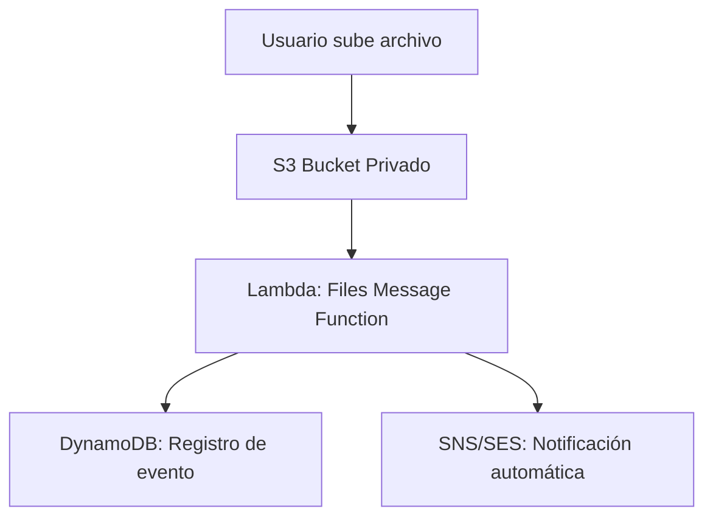
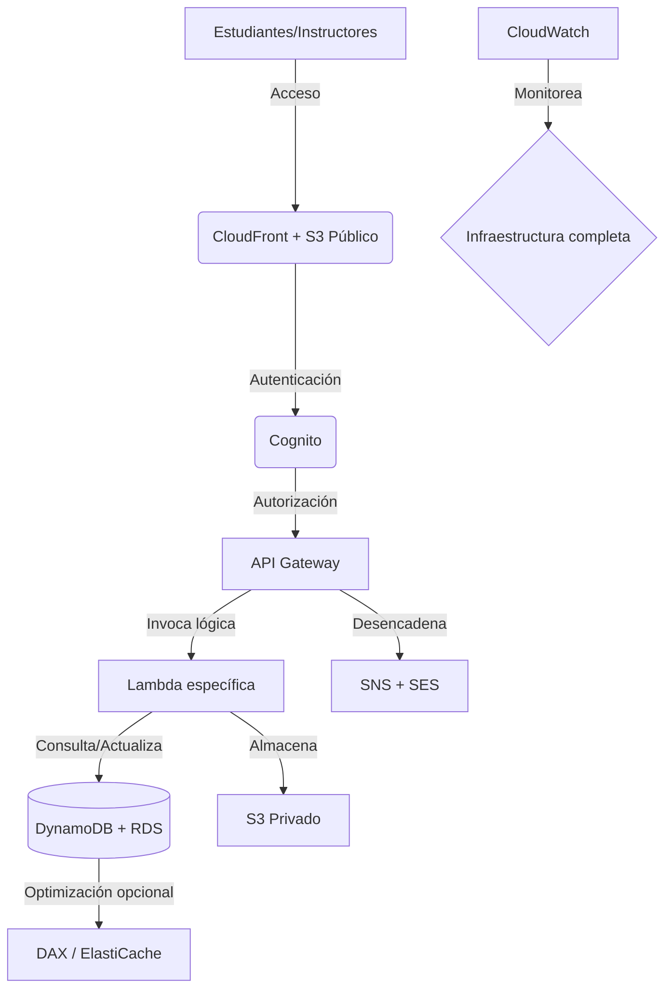
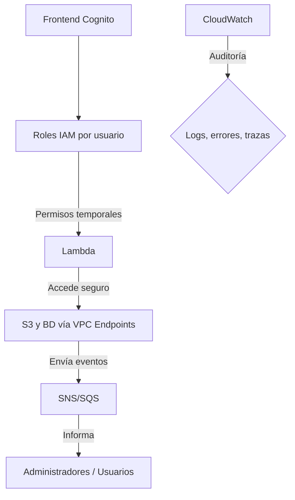

# OnlineReady

OnlineReady es una plataforma para la gestión, distribución y monitoreo de cursos online, orientada a escuelas técnicas. La infraestructura está desplegada sobre AWS utilizando Terraform, y sigue un enfoque modular, seguro y escalable.

## Componentes Principales

- **Frontend**
  - Distribuido con Amazon CloudFront y contenido estático en un bucket público de S3.
  - Autenticación centralizada mediante Amazon Cognito.
  - IAM Identity Center opcional para usuarios internos o administrativos.

- **Backend**
  - Rutas diferenciadas en Amazon API Gateway (`/api/cursos`, `/api/usuarios`, `/api/archivos`) que dirigen a funciones Lambda específicas.
  - Lambdas separadas por flujo lógico: `Courses`, `Users`, `Files`, `Mensajes`.
  - Operaciones CRUD sobre:
    - **Amazon RDS (PostgreSQL)**: `tabla: CursoDocente`, `tabla: Usuarios`
    - **Amazon DynamoDB**: `tabla: MetadatosCursos`
  - Almacenamiento segmentado en S3:
    - `S3 Público`: distribución de recursos accesibles
    - `S3 Privado`: almacenamiento interno de materiales académicos
  - Acceso a S3 mediante **VPC Gateway Endpoints**, evitando exposición a Internet.

- **Orquestación y Alta Disponibilidad**
  - Procesos desacoplados mediante **Amazon SQS** (colas) y **SNS** (notificaciones).
  - Automatización de subida y procesamiento de archivos a través de `Lambda Files Manager`.

- **Monitoreo**
  - AWS CloudWatch para registros y métricas.
  - Trazabilidad de eventos y alarmas operativas.

---

## Flujo de Carga de Archivos

------

## Flujo General de Plataforma

----

## Seguridad y Acceso
