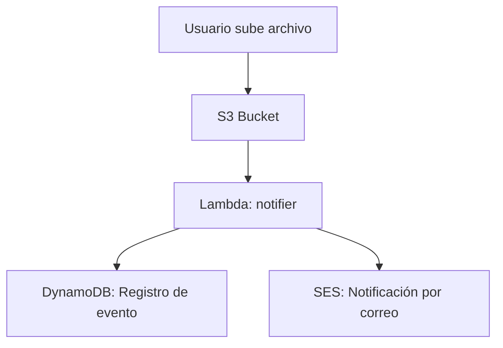

# OnlineReady

**OnlineReady** es una plataforma para la gestión y distribución de cursos online, diseñada para escuelas técnicas. Utiliza servicios de AWS para automatizar la recepción de materiales, el almacenamiento seguro, la notificación automática y el registro de eventos.

